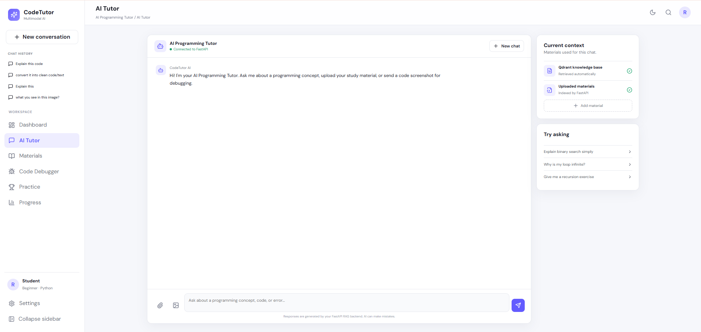

# AI Programming Tutor — Multimodal RAG Chatbot

> An AI-powered programming learning platform that combines Retrieval-Augmented Generation (RAG), vector search, multimodal AI, document intelligence, and AI-assisted code debugging in a single application.

[](https://www.python.org/)
[](https://react.dev/)
[](https://fastapi.tiangolo.com/)
[](https://vite.dev/)
[](https://qdrant.tech/)
[](https://www.docker.com/)

---

## 📌 Overview

**AI Programming Tutor** is a full-stack AI learning application designed to help students learn programming, understand technical concepts, ask questions from their own study materials, debug code, and analyze programming-related images or screenshots.

The application combines three major AI capabilities:

1. **RAG-based document question answering**
2. **Multimodal / vision-based image analysis**
3. **AI-assisted code debugging**

The system uses a React/Vite frontend, a Python FastAPI backend, Sentence Transformers for embeddings, Qdrant for vector search, and OpenAI-compatible LLM/vision APIs.

---

## ✨ Key Features

### 🤖 AI Programming Tutor

Ask technical questions and receive clear, beginner-friendly explanations.

The tutor is designed for topics such as:

- Python
- Java
- C / C++
- JavaScript
- Data Structures & Algorithms
- Object-Oriented Programming
- Databases
- Web Development
- Artificial Intelligence
- Machine Learning
- Computer Networks
- Operating Systems
- Software Engineering
- Cloud and development tools

### 📚 RAG-Based Document Q&A

Upload your own learning material and ask questions based on the uploaded document.

Supported document types include:

- PDF
- DOCX
- TXT
- Markdown
- Source-code files

### RAG workflow

```text
Document Upload
      ↓
Text Extraction
      ↓
Text Chunking
      ↓
Embedding Generation
      ↓
Qdrant Vector Database
      ↓
Semantic Search
      ↓
Relevant Context
      ↓
LLM
      ↓
Grounded Answer
```

When a document is attached, the system can restrict retrieval to that specific document instead of searching unrelated uploaded materials.

If the answer cannot be found in the selected document, the tutor can respond:

> "I couldn't find the answer to this question in the uploaded document."

### 🖼️ Multimodal AI

Users can upload programming-related images and screenshots and ask questions about them.

Examples:

- Code screenshots
- IDE screenshots
- Compiler errors
- Error messages
- Programming diagrams
- Flowcharts
- Technical images

```text
Upload Image
     ↓
User Question
     ↓
Vision Model
     ↓
Image Understanding
     ↓
Technical Explanation
```

The vision service is designed to explain what is visible in the image without inventing details.

### 🐞 AI Code Debugger

The Code Debugger uses AI-based static analysis to help beginners understand programming errors.

It can identify and explain issues such as:

- `SyntaxError`
- `NameError`
- `TypeError`
- `IndexError`
- `AttributeError`
- `ImportError`
- `ModuleNotFoundError`
- Logic errors
- Other code-level problems

The debugger provides:

- Error type
- Line number
- Incorrect code
- Explanation
- Cause
- Corrected line
- Complete corrected code
- Beginner-friendly learning points
- Optional improvements separately from actual errors

> User code is analyzed using AI static analysis and is not directly executed on the FastAPI server.

### 💬 Conversational AI Interface

The application provides an interactive chat experience with:

- New conversations
- Conversation history
- AI responses
- File attachments
- Image attachments
- Source references
- Loading states
- Error handling
- Dark/light interface

### 📎 File Attachments

Uploaded files are displayed inside the conversation.

The interface supports displaying:

- Images
- PDF documents
- Other file types

Images can be previewed directly, while documents and other files can be displayed as attachment cards.

### 📄 Source References

For RAG responses, retrieved document information can be returned with metadata such as:

- Filename
- Page number
- Document ID
- Chunk ID
- Retrieval score

---

# 🏗️ System Architecture

```text
┌─────────────────────────────────────────────┐
│              React + Vite Frontend          │
│                                             │
│  Dashboard │ AI Tutor │ Materials │         │
│  Debugger  │ Multimodal │ Practice          │
└──────────────────────┬──────────────────────┘
                       │
                       │ HTTP / REST API
                       ▼
┌─────────────────────────────────────────────┐
│                FastAPI Backend               │
│                                             │
│  Chat API │ Documents │ Debugger │ Vision  │
└──────────────┬──────────────┬──────────────┘
               │              │
       ┌───────┘              └───────────────┐
       ▼                                       ▼
┌──────────────────┐                 ┌──────────────────┐
│   RAG Service    │                 │ Multimodal       │
│                  │                 │ Vision Service   │
└────────┬─────────┘                 └────────┬─────────┘
         │                                    │
         ▼                                    ▼
┌──────────────────┐                 ┌──────────────────┐
│ Sentence        │                 │ Vision LLM       │
│ Transformers     │                 │                  │
└────────┬─────────┘                 └──────────────────┘
         │
         ▼
┌──────────────────┐
│     Qdrant       │
│   Vector DB      │
└────────┬─────────┘
         │
         ▼
┌──────────────────┐
│      LLM         │
│  Answer / Tutor  │
└──────────────────┘
```

---

# 🔄 Detailed RAG Pipeline

```text
             ┌──────────────────┐
             │ Uploaded PDF/DOCX│
             └────────┬─────────┘
                      ↓
              ┌───────────────┐
              │ Text Extractor│
              └───────┬───────┘
                      ↓
                ┌───────────┐
                │  Chunks   │
                └─────┬─────┘
                      ↓
              ┌───────────────┐
              │  Embeddings   │
              └───────┬───────┘
                      ↓
              ┌───────────────┐
              │    Qdrant     │
              └───────┬───────┘
                      │
User Question ────────┤
                      ↓
              ┌───────────────┐
              │ Semantic      │
              │ Search        │
              └───────┬───────┘
                      ↓
              ┌───────────────┐
              │ Relevant      │
              │ Context       │
              └───────┬───────┘
                      ↓
              ┌───────────────┐
              │      LLM      │
              └───────┬───────┘
                      ↓
              ┌───────────────┐
              │ Grounded      │
              │ Answer        │
              └───────────────┘
```

---

# 🧠 Technology Stack

## Frontend

| Technology | Purpose |
|---|---|
| React.js | Interactive user interface |
| Vite | Frontend development and build tool |
| JavaScript | Application logic |
| CSS | UI styling |

## Backend

| Technology | Purpose |
|---|---|
| Python | Backend and AI service development |
| FastAPI | REST API framework |
| Pydantic | Request/data validation |
| PyMuPDF | PDF text extraction |
| python-docx | DOCX processing |
| Pillow | Image processing |

## AI / ML

| Technology | Purpose |
|---|---|
| Large Language Model | AI tutoring and code analysis |
| Vision LLM | Image and screenshot analysis |
| Sentence Transformers | Text embeddings |
| RAG | Grounded document Q&A |
| Semantic Search | Relevant context retrieval |

## Vector Database

| Technology | Purpose |
|---|---|
| Qdrant | Vector storage and similarity search |

## Infrastructure & Tools

| Technology | Purpose |
|---|---|
| Docker | Containerization |
| Docker Compose | Qdrant service management |
| Git | Version control |
| GitHub | Source-code hosting |

---

# 📁 Project Structure

```text
AI-Programming-Tutor/
│
├── backend/
│   ├── app/
│   │   ├── api/
│   │   │   ├── __init__.py
│   │   │   ├── chat.py
│   │   │   ├── debugger.py
│   │   │   ├── documents.py
│   │   │   ├── health.py
│   │   │   └── multimodal.py
│   │   │
│   │   ├── models/
│   │   │   └── __init__.py
│   │   │
│   │   ├── services/
│   │   │   ├── __init__.py
│   │   │   ├── code_service.py
│   │   │   ├── embedding_service.py
│   │   │   ├── ingestion_service.py
│   │   │   ├── llm_service.py
│   │   │   ├── qdrant_service.py
│   │   │   ├── rag_service.py
│   │   │   └── vision_service.py
│   │   │
│   │   ├── __init__.py
│   │   ├── config.py
│   │   └── main.py
│   │
│   ├── data/
│   │   ├── uploads/
│   │   └── qdrant/
│   │
│   ├── .env.example
│   ├── docker-compose.yml
│   ├── README.md
│   └── requirements.txt
│
├── frontend/
│   ├── src/
│   ├── .env.example
│   ├── README.md
│   ├── index.html
│   ├── package-lock.json
│   └── package.json
│
├── .gitignore
└── README.md
```

---

# 🚀 Getting Started

## Prerequisites

- Python 3.10+
- Node.js 18+
- npm
- Git
- Docker Desktop

## 1. Clone the Repository

```bash
git clone https://github.com/YOUR_USERNAME/AI-Programming-Tutor.git
cd AI-Programming-Tutor
```

## 2. Backend Setup

```powershell
cd backend
python -m venv .venv
.\.venv\Scripts\Activate.ps1
pip install -r requirements.txt
```

## 3. Environment Configuration

Create:

```text
backend/.env
```

Use `backend/.env.example` as the template.

Example:

```env
LLM_BASE_URL=https://api.groq.com/openai/v1
LLM_API_KEY=your_api_key_here
LLM_MODEL=openai/gpt-oss-120b
VISION_MODEL=qwen/qwen3.8-27b

QDRANT_URL=http://localhost:6333
QDRANT_API_KEY=
QDRANT_COLLECTION=programming_tutor
```

> Never commit `.env` files, API keys, tokens, passwords, or other secrets.

## 4. Start Qdrant

From the `backend` directory:

```powershell
docker compose up -d
```

Verify:

```powershell
docker ps
```

Qdrant:

```text
http://localhost:6333
```

## 5. Start the FastAPI Backend

```powershell
uvicorn app.main:app --reload
```

Backend:

```text
http://127.0.0.1:8000
```

API documentation:

```text
http://127.0.0.1:8000/docs
```

## 6. Frontend Setup

Open another terminal:

```powershell
cd frontend
npm install
npm run dev
```

Frontend:

```text
http://localhost:5173
```

---

# 🔌 API Endpoints

| Method | Endpoint | Description |
|---|---|---|
| `GET` | `/api/health` | Backend health check |
| `POST` | `/api/chat` | AI tutor and RAG chat |
| `POST` | `/api/documents/upload` | Upload and index document |
| `GET` | `/api/documents` | Retrieve uploaded documents |
| `POST` | `/api/code/analyze` | Analyze programming code |
| `POST` | `/api/multimodal/analyze-image` | Analyze an uploaded image |

---

# 🧪 Example Workflows

## Programming Question

```text
User
 ↓
"What is inheritance in Python?"
 ↓
AI Programming Tutor
 ↓
Beginner-friendly explanation
```

## PDF Question Answering

```text
Upload Data Structures.pdf
          ↓
Document Processing
          ↓
Qdrant Indexing
          ↓
Ask Question
          ↓
Semantic Search
          ↓
Relevant PDF Chunks
          ↓
LLM
          ↓
Grounded Answer
```

## Code Debugging

```python
numbers = [1, 2, 3]

print(numbers[5])
```

The debugger can identify:

```text
Error Type:
IndexError

Problem:
The requested index does not exist.

Fix:
Use a valid index within the list.
```

## Multimodal Analysis

```text
Upload programming screenshot
          ↓
Ask a question
          ↓
Vision Model
          ↓
Image understanding
          ↓
Technical explanation
```

---

# 🔒 Security & Safety

The project includes several security-conscious design decisions:

- API keys are stored in environment variables.
- `.env` files are excluded from version control.
- User code is not directly executed on the backend.
- Code debugging uses AI static analysis.
- Uploaded files are processed through dedicated services.
- Image uploads are validated before vision processing.

For production deployment, additional measures are recommended:

- Authentication and authorization
- Role-based access control
- Rate limiting
- Secure file storage
- File content validation
- Sandboxed code execution
- HTTPS
- Secret management
- Monitoring and logging
- Abuse protection

---

# 🎯 Problem Statement

Programming students often face:

- Difficulty understanding programming concepts
- Difficulty debugging code independently
- Difficulty finding specific information in lengthy study materials
- Lack of personalized technical assistance
- Difficulty understanding screenshots and error messages
- Dependence on multiple separate learning tools

**AI Programming Tutor** brings learning assistance, document-grounded Q&A, code debugging, and multimodal understanding together in one platform.

---

# 💡 Solution

The platform provides a unified learning environment:

```text
Learn
  ↓
Ask Questions
  ↓
Upload Study Materials
  ↓
Search Documents with RAG
  ↓
Debug Code
  ↓
Analyze Screenshots
  ↓
Understand Concepts
  ↓
Practice & Track Learning
```

---

# 📈 Learning Outcomes

This project demonstrates practical experience with:

- Full-stack development
- Generative AI
- Retrieval-Augmented Generation
- Large Language Models
- Multimodal AI
- Vector databases
- Semantic search
- Natural Language Processing
- Document processing
- REST API development
- React
- FastAPI
- Docker
- Git/GitHub
- AI system architecture

---

# 🔮 Future Enhancements

- [ ] User authentication
- [ ] Role-based access control
- [ ] Persistent cloud chat history
- [ ] Personalized learning paths
- [ ] AI-generated quizzes
- [ ] Coding practice challenges
- [ ] Learning progress analytics
- [ ] Secure sandboxed code execution
- [ ] More programming language support
- [ ] Hybrid keyword + vector search
- [ ] Retrieval reranking
- [ ] Improved source/citation highlighting
- [ ] Production deployment
- [ ] Mobile optimization
- [ ] Voice-based programming assistance

---

# 📸 Screenshots

Recommended screenshots to add to the repository:

1. Dashboard
2. AI Tutor chat
3. PDF upload and RAG response
4. Code Debugger
5. Multimodal image analysis

Example:

```markdown



```

---

# 🧩 Core Components

### Frontend

Responsible for:

- User interface
- Chat interaction
- File selection
- Image upload
- Code debugging interface
- Study material management
- Conversation management
- Loading and error states

### FastAPI Backend

Responsible for:

- API routing
- Request validation
- Document processing
- RAG orchestration
- LLM communication
- Vision model communication
- Code analysis

### RAG Service

Responsible for:

- Query embedding
- Qdrant search
- Document filtering
- Context construction
- Grounded answer generation

### Qdrant Service

Responsible for:

- Vector storage
- Similarity search
- Document metadata
- Document-specific retrieval

### Vision Service

Responsible for:

- Image encoding
- Vision model requests
- Programming screenshot analysis
- Technical image understanding

### Code Service

Responsible for:

- AI-based code analysis
- Error identification
- Line-level explanations
- Corrected code generation
- Beginner-friendly debugging guidance

---

# 🛠️ Development Architecture

```text
React / Vite
      │
      │ REST API
      ▼
FastAPI
      │
      ├── RAG Service
      │      ├── Embeddings
      │      └── Qdrant
      │
      ├── LLM Service
      │
      ├── Vision Service
      │
      ├── Code Service
      │
      └── Document Service
```

This separation keeps the application modular and makes individual services easier to maintain, test, extend, and deploy.

---

# 🤝 Contributing

Contributions and suggestions are welcome.

```bash
git clone https://github.com/YOUR_USERNAME/AI-Programming-Tutor.git
cd AI-Programming-Tutor

git checkout -b feature/your-feature

# Make your changes

git add .
git commit -m "Add your feature"

git push origin feature/your-feature
```

Then open a Pull Request on GitHub.

---

# 📄 License

This project does not currently specify an open-source license.

If the repository is intended for public reuse, an appropriate license such as MIT can be added later.

---

# 👩‍💻 Author

## Rogitha S

**B.Sc. Computer Science with Artificial Intelligence**

### Areas of Interest

- Artificial Intelligence
- Machine Learning
- Generative AI
- Retrieval-Augmented Generation
- Multimodal AI
- Full-Stack Development
- Data Science
- Natural Language Processing

---

## ⭐ Project

**AI Programming Tutor — Multimodal RAG Chatbot**

A full-stack AI learning platform combining:

**RAG + Vector Search + LLM + Vision AI + Code Debugging + React + FastAPI**

If you find this project useful, consider giving the repository a ⭐ star.
